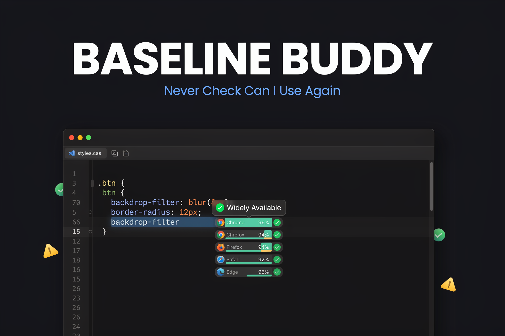

# 🔧 Baseline Buddy

**Know if a web feature is safe to use — browser compatibility intel right inside VS Code**

 

 

Baseline Buddy is a VS Code extension that surfaces web feature compatibility data directly in your editor as you write CSS, JavaScript, TypeScript, and HTML. Powered by the [Baseline](https://web.dev/baseline) standard, it gives you instant, in-context feedback on whether a feature is widely supported, newly available, or still limited — so you can ship with confidence without leaving your editor.

## ✨ Features

- **Hover tooltips** — Instant compatibility info when hovering over CSS properties, JS APIs, HTML elements, and TypeScript features
- **Multi-language support** — Works across CSS, JavaScript, TypeScript, and HTML files
- **Baseline status indicators** — Clear visual signals: ✅ Widely Available, 🟡 Newly Available, ⚠️ Limited Availability
- **Broad feature coverage** — Detects CSS layout, modern JS APIs, semantic HTML, observer APIs, and more
- **Configurable** — Control which features appear and which browsers to target through VS Code settings
- **Zero dependencies** — No external tools or runtimes required

## 🎥 Demo

## 🛠️ Tech Stack

VS Code Extension API · Baseline · TypeScript · CSS / JS / HTML language support

## 🚀 Getting Started

**Requirements:** VS Code 1.103.0 or higher — no additional dependencies needed.

1. Install the extension from the VS Code Marketplace
2. Open any CSS, JavaScript, TypeScript, or HTML file
3. Hover over a web feature (e.g. `display: grid`, `fetch()`, `<dialog>`) to see its Baseline status

**Available settings:**

| Setting | Default | Description |
|---|---|---|
| `baseline-buddy.enableHover` | `true` | Enable/disable hover tooltips |
| `baseline-buddy.showUnsupportedFeatures` | `true` | Show info for limited-availability features |
| `baseline-buddy.includeBrowserList` | `["chrome","firefox","safari","edge"]` | Browsers to consider for compatibility |

## 📄 License

MIT
